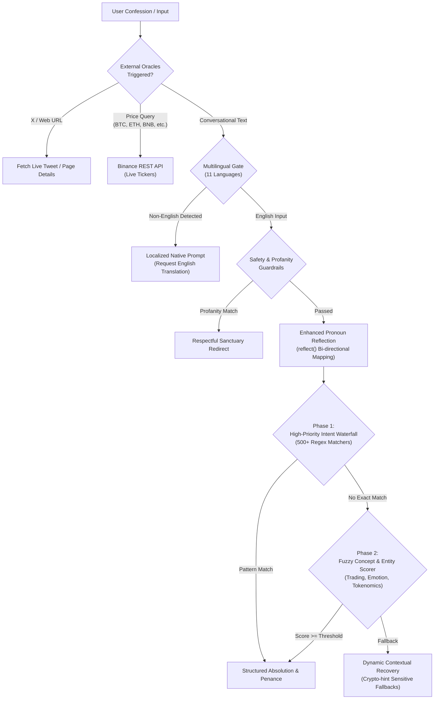

# Virtue: AI Agent & Real-Time Financial Calculator

An interactive, pattern-matching AI conversational agent and real-time cryptocurrency financial calculator. Built with Next.js 16 (App Router), React 19, TypeScript, Tailwind CSS, and live Binance market data.

**Live Application:** [https://virtue-ecru.vercel.app](https://virtue-ecru.vercel.app)  
**License:** MIT

---

## Overview

Virtue is a dual-function conversational web application designed for interactive natural language dialogue and live cryptographic asset valuation.

Unlike standard thin wrappers around paid LLM APIs, Virtue features an **in-house, deterministic Natural Language Processing (NLP) engine** (`app/api/absolution/route.ts`) spanning over **2,200 lines of custom TypeScript logic**. 

### Why Custom Deterministic NLP?
- **Zero Ongoing Token Costs:** 100% self-hosted conversational logic with zero external API bills.
- **Ultra-Low Latency (<15ms):** Runs instantly at the edge without third-party API network overhead or queuing.
- **Zero Mathematical Hallucinations:** Guarantees absolute accuracy on financial calculations, contract logic, and dividend rules.
- **Complete Privacy & Resilience:** Operates without rate limits, cold starts, or third-party platform dependencies.

---

## 🧠 Core NLP Pipeline Architecture (`app/api/absolution/route.ts`)

The conversational intelligence operates as a 7-stage deterministic waterfall:



---

## Key Features

- **Custom Multi-Tier NLP Engine (`app/api/absolution/route.ts`):**
  - **High-Priority Intent Waterfall:** Matches hundreds of domain-specific patterns covering trading psychology, leverage liquidations, impermanent loss, dev history, and smart contract safety.
  - **Contextual Memory & Pronoun Reflection:** Implements a recursive grammatical reflection algorithm (`reflect(text)`) transforming first-person user confessions into second-person counselor responses.
  - **Multi-Domain Fuzzy Concept Scoring:** Classifies incoming messages across multiple contextual vectors (Tokenomics, CZ Lore, Emotional Distress, Market Volatility).
  - **Crypto-Hint Sensitive Fallbacks:** If no exact or fuzzy match triggers, a contextual selector differentiates between crypto-specific queries and philosophical conversations.
- **Polyglot Multilingual Gate:**
  - Regex-based Unicode & stopword classification for **11 languages** (Chinese, Japanese, Korean, Russian, Arabic, Turkish, Portuguese, German, Italian, Spanish, French).
  - Automatically responds with a tailored localized message in the user's native alphabet politely directing them to communicate in English.
- **Live Exchange & Web Oracles:**
  - Automated spot ticker retrieval via **Binance REST API** (`api.binance.com`) for BTC, ETH, BNB, SOL, DOGE, XRP, ADA.
  - On-the-fly Twitter/X status link and web URL inspection.
- **Dynamic Penance & Valuation Engine:**
  - Dynamic mathematical parser for calculating token amounts, fiat approximations, and portfolio loss metrics.
  - Generates structured, actionable "Divine Penances" with pre-filled 1-click Twitter/X sharing templates.
- **Community-Driven Model Improvement:**
  - Dedicated `💡 Improve Model` flow allowing the community to propose new NLP patterns, intents, and conversational branches directly.
- **Modern Responsive Architecture:**
  - Built on Next.js 16 with React 19 server/client components.
  - High-performance dark-theme UI styled with Tailwind CSS.
  - Deployed globally on Vercel Edge Network.

---

## Tech Stack

- **Framework:** Next.js 16 (App Router), React 19
- **Language:** TypeScript
- **Styling:** Tailwind CSS
- **APIs:** Binance Public REST API
- **Deployment:** Vercel

---

## Getting Started

### Prerequisites
- Node.js 18+
- npm, pnpm, or bun

### Local Setup
```bash
# Clone the repository
git clone https://github.com/Lukecele/virtue.git
cd virtue

# Install dependencies
npm install

# Run the development server
npm run dev
```

Open [http://localhost:3000](http://localhost:3000) with your browser.

---

## ⚖️ Open-Source Architecture & Research Notice

This repository represents free, open-source computational linguistic research and deterministic NLP software (MIT License) developed by independent open-source software engineers.

- **Non-Custodial NLP Research:** This software functions strictly as a rule-based conversational interface and decentralized mathematical calculator. It does not operate a financial exchange, execute custody over digital assets, or provide investment or financial advice.
- **MiCA Exemption (Recital 22):** Open-source analytical software, algorithmic modeling tools, and decentralized conversational engines operate outside the scope of crypto-asset service provider (CASP) regulations.
- **Meme Culture & Entertainment:** The conversational themes are inspired by crypto culture and community lore for educational and entertainment purposes.

---

## License

Released under the [MIT License](./LICENSE).
