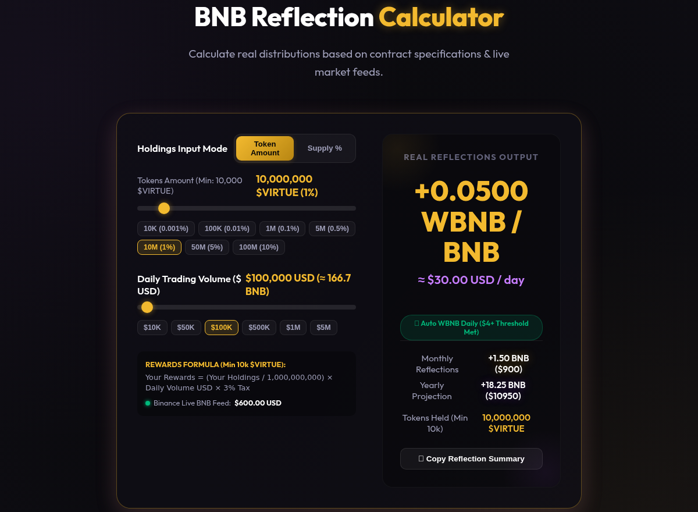

# Virtue

**A rule-based conversational engine and crypto calculator for exploring scripted dialogue and market-data integrations.**

By **Luca Celebrano · [@Lukecele](https://github.com/Lukecele)**

[Try the demo](https://virtue-ecru.vercel.app) · [Explore the source](https://github.com/Lukecele/virtue) · [Star on GitHub](https://github.com/Lukecele/virtue) · [Follow Lukecele](https://github.com/Lukecele)

[](https://github.com/Lukecele/virtue/actions/workflows/ci.yml)
[](LICENSE)



*Real screenshot of the public demo's calculator. Figures are illustrative projections, not observed earnings. The displayed $600 BNB price matches the configured fallback and does not verify live pricing.*

## What you can try

The interface uses a crypto-themed “Forgiveness Booth” for conversation and a separate Reflection Calculator. It is built with Next.js, React, TypeScript and plain CSS.

1. **Explore the rules:** open the [Forgiveness Booth](https://virtue-ecru.vercel.app/#booth) and send `/help`. It returns a predefined capabilities menu. Other matched prompts can choose randomly among authored replies; repeated inputs need not produce identical wording.
2. **Request a quote:** send `btc price`. The server tries Binance's BTC/USDT ticker, then CoinGecko's USD price. The response names its source when successful; if both fail, it directs you to external price pages. The value changes with the market.
3. **Reproduce a calculation:** open the [calculator](https://virtue-ecru.vercel.app/#calculator), set holdings to **10,000,000 tokens** and daily volume to **$100,000** (the defaults). The implemented formula gives **$30/day**: `(10,000,000 / 1,000,000,000) × 100,000 × 0.03`. BNB conversion depends on the fetched price or the fallback described below. This is a hypothetical scenario, not a forecast or verified payout.

## Quick start

Use **Node.js 22.18+ or 24+** and npm. CI uses Node 22; the test script imports TypeScript directly through Node's built-in type stripping.

```bash
git clone https://github.com/Lukecele/virtue.git
cd virtue
npm ci
npm run dev
```

Open [localhost:3000](http://localhost:3000). No API keys or environment variables are required by the current code. External data features require network access; font loading also uses Google Fonts.

You can call the local conversation endpoint directly:

```bash
curl http://localhost:3000/api/absolution \
  -H 'Content-Type: application/json' \
  -d '{"messages":[{"role":"user","content":"/help"}]}'
```

The JSON response contains `reply` and `penance` strings. The browser sends conversation history with each request.

| Command | Purpose |
| --- | --- |
| `npm run dev` | Start the development server |
| `npm test` | Run the helper-level NLP tests in `tests/` |
| `npm run lint` | Run ESLint |
| `npm run build` | Create a production build |
| `npm start` | Serve a completed production build |

[CI](.github/workflows/ci.yml) runs the tests and production build. [Contributing](CONTRIBUTING.md) also requires linting. The test suite covers helpers in `lib/nlp-engine.ts`; it does not verify every conversational rule or the external integrations.

## How it works

| Component | Responsibility |
| --- | --- |
| [`app/page.tsx`](app/page.tsx) | Chat UI, in-memory conversation state, calculator formulas and browser-side BNB price refresh |
| [`app/api/absolution/route.ts`](app/api/absolution/route.ts) | External lookups, language heuristics, ordered regex rules, pronoun reflection, keyword scoring and fallback replies |
| [`lib/nlp-engine.ts`](lib/nlp-engine.ts) | Separately tested language, reflection and profanity helpers; the route currently maintains its own implementation |
| [`app/globals.css`](app/globals.css) | Responsive styling and the existing gold/purple palette |

The conversation engine uses hand-authored rules and templates, with limited context from the supplied history. It does not call an LLM, train a model, or learn automatically from feedback. “Improve Model” opens a prefilled X post for suggestions.

### Where external services are used

- **Ordinary conversation:** handled by the application's server without an external language-model API. This does not make the whole application offline: the page separately fetches BNB prices.
- **Chat price requests:** Binance first, CoinGecko as a fallback, for BTC, ETH, BNB, SOL, DOGE, XRP and ADA. Binance quotes are denominated in USDT; CoinGecko requests USD.
- **Calculator conversion:** the browser requests BNB/USDT from Binance on load and every 60 seconds. It starts with a hard-coded **600** price and retains the previous value if no new price is available. There is no CoinGecko fallback or freshness indicator for this calculator.
- **Pasted links:** the server can request Twitter/X oEmbed or fetch a page's title and description. This is metadata extraction with scripted commentary, not general web research or verification. Flap.sh links have a scripted special case.
- **Fonts and outbound links:** Google Fonts supplies fonts; sharing and token links open third-party sites.

## Limits

- Rules can miss intent, language detection is heuristic, and replies can vary randomly. This is not a general-purpose assistant.
- Token supply, fee rates, eligibility thresholds and token-related claims are embedded in the code. The calculator does not read wallet balances or verify contracts, liquidity, distributions or investment safety. Some existing UI and chat wording makes claims that these mechanisms do not substantiate.
- Calculations use JavaScript numbers, simplified assumptions and display rounding. USD-labelled conversions use a USDT pair as a proxy; monthly and yearly estimates multiply the same daily scenario by 30 and 365. They are not guarantees of accuracy or returns.
- External APIs can fail, time out, restrict regions or rate-limit requests. Cached/default values and generic fallback replies can conceal missing live data. No latency, uptime, privacy or cost guarantees are made.
- Messages are sent to the server. Pasted URLs may be forwarded to external services or requested sites; the browser contacts Binance and Google Fonts. No database-backed chat persistence is implemented, but hosting/provider logging is outside this code's guarantees. Avoid entering sensitive information.
- There is no LLM token billing in this implementation. Hosting, bandwidth and external-service terms still apply.

The application is an experimental, crypto-themed software project. Its scripted content and projections should not be treated as investment guidance.

## Contribute and follow

See [CONTRIBUTING.md](CONTRIBUTING.md) for development checks and [SECURITY.md](SECURITY.md) for private security reporting. Focused contributions to rules, clarity and test coverage are welcome.

If the implementation is useful to you, [star Virtue](https://github.com/Lukecele/virtue) or [follow Luca's projects](https://github.com/Lukecele).

Released under the [MIT License](LICENSE).
